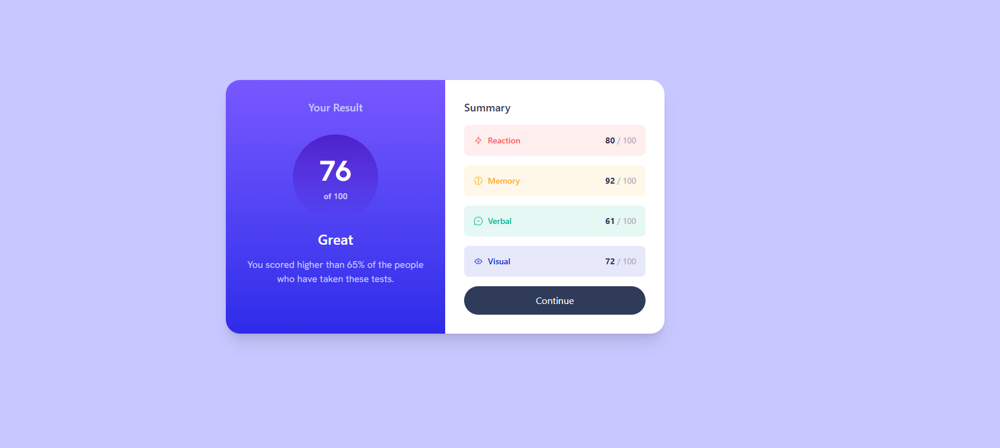

## Results Summary Component

This project is a mobile-friendly results summary card built with React and Tailwind CSS. It displays a user's test result, a summary of scores for different categories, and a call-to-action button. The design is inspired by a Frontend Mentor challenge and focuses on clean layout, responsive design, and dynamic data rendering from a JSON file.

### Project Showcase

**Built with:**
- React
- Tailwind CSS v4
- Frontend Mentor challenge assets